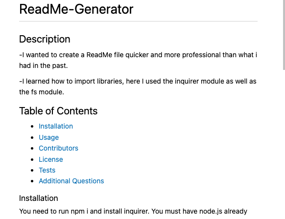

# ReadMe-Generator

## Description

-I wanted to create a ReadMe file quicker and more professional than what i had in the past.

-I learned how to import libraries, here I used the inquirer module as well as the fs module.

## Table of Contents

- [Installation](#installation)
- [Usage](#usage)
- [Contributors](#contributors)
- [License](#license)
- [Tests](#tests)
- [Additional Questions](#additional-questions-)

### Installation

You need to run npm i and install inquirer. You must have node.js already installed to run this program.

### Usage

### Contributors

**https://github.com/MinnieAkuma199**

### License

### Tests

none

### Additional Questions

**kristyndcb@gmail.com**
